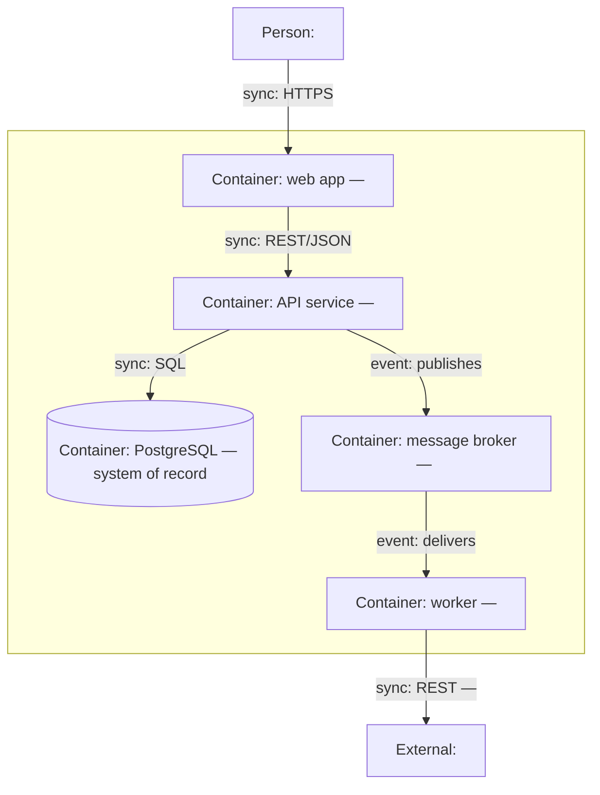

# Containers (C4 level 2)

What runs, what stores data, and what talks to what — with protocols and
responsibilities. Same mandatory arrow-label vocabulary as the context
diagram (`sync:` / `event:` / `data:` / `dep:` / `deploy:`).

<!-- Keep responsibilities to a phrase per container; anything longer belongs
     in overview.md or an ADR. In highly dynamic topologies, prefer pointing
     at tracing/APM for the interaction map and keep only the stable
     boundaries here (see right-sizing: durability ordering). -->
