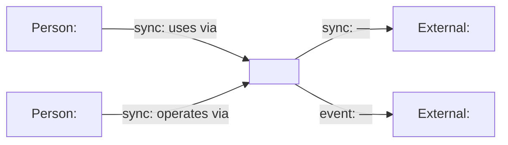

# System context (C4 level 1)

Who uses the system and what it depends on. One diagram, one question.

Arrow labels are mandatory and carry the interaction kind:
`sync:` request/response · `event:` publish/subscribe · `data:` batch or
replication · `dep:` build-time dependency · `deploy:` deployment relation.

<!-- Replace every placeholder with the real name before committing — a
     committed diagram with generic nodes is a defect. Delete nodes that do
     not exist; add the ones that do. -->
