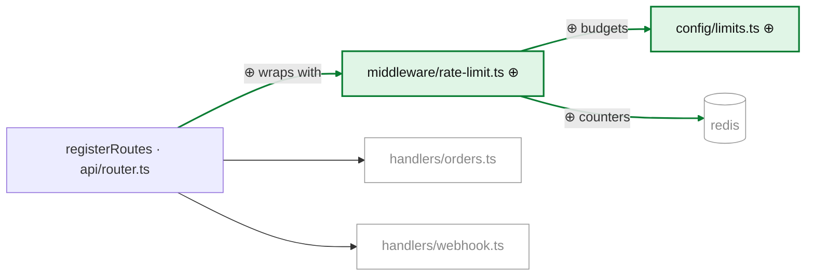

# Prospective delta example — a full plan tour at small scale

Format reference, not a template. Size the real tour to the real plan; write
it in the user's language. Painting rules and edge accounting come from the
`pr-tour` examples — this file shows what is *different* about a plan tour:
⊕ means "will exist", the plan-vs-code section, and open questions.

The plan being toured (user-provided): *"Add rate limiting to the public
API: create `middleware/rate-limit.ts` with a sliding-window limiter backed
by the existing redis client, add limit values to `config/limits.ts` (new),
and wire the middleware into `api/server.ts` for the two public routes."*

## Narrative

> Today every public request flows straight from `api/router.ts` to its
> handler — `registerRoutes()` at `api/router.ts:12` mounts the handlers
> with no middleware between them and the network. The plan inserts a
> sliding-window limiter in that gap: a new `middleware/rate-limit.ts`
> reads its budgets from a new `config/limits.ts`, counts against the
> existing redis client, and wraps the public handlers so an over-budget
> caller gets `429` before any handler runs. Net effect: the router's
> mounting changes, the handlers themselves do not.

## Prospective delta

> The diagram paints the planned end state over today's terrain.

`Legend: ⊕ solid green = will exist once the plan lands · unmarked = exists today, the plan changes it · gray = exists today, the plan does not touch it`

The legend carries the tense, and that is the entry the reader most needs: in
a plan tour ⊕ is a promise, not a fact of the tree, and a reader arriving from
a `pr-tour` reads it as "already added" unless the line says otherwise. Like
every other line of the tour, it is written in the user's language — English
here only because this file is a reference for you.

Edge accounting: `R→L`, `L→C`, `L→S` will exist only after the plan lands →
added. `R→H` and `R→W` exist today and survive → context, unpainted.
`api/router.ts` is the plan's modify target → default styling, undimmed.

## Plan vs. code

> - The plan wires the middleware "into `api/server.ts`"; the code mounts
>   routes in `registerRoutes()` at `api/router.ts:12` — `api/server.ts`
>   only calls it and never sees individual routes.
> - The plan says "the two public routes"; the router registers three —
>   `handlers/webhook.ts` is mounted without auth at `api/router.ts:19`,
>   so it is public too and either gets limited or becomes a bypass.
> - The plan assumes "the existing redis client" is shareable; the code
>   shows it is created per-request in `lib/redis.ts:8` — a sliding window
>   needs a persistent connection.

## Terrain reading order

> 1. `api/router.ts` — first: the mounting the plan will change lives
>    here, not in `server.ts`. Look at: the wrapper pattern already used
>    for auth at `api/router.ts:15` — the limiter will want the same shape.
> 2. `lib/redis.ts` — the constraint. Look at: the per-request factory at
>    `lib/redis.ts:8` — decides whether the limiter can hold a connection.
> 3. `api/router.test.ts` — the behavior the plan must not break. Look at:
>    the webhook test fixes today's unlimited behavior — it will need a
>    deliberate update, not an accidental one.

## Open questions

> - Per-route or global budgets? Decides whether `config/limits.ts` is a
>   map keyed by route or a single scalar, and what
>   `middleware/rate-limit.ts` uses as the lookup key.
> - What identifies a caller — IP, API key, both? The webhook route has no
>   API key, so the answer differs per route.
