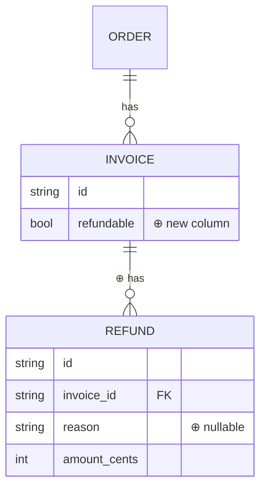
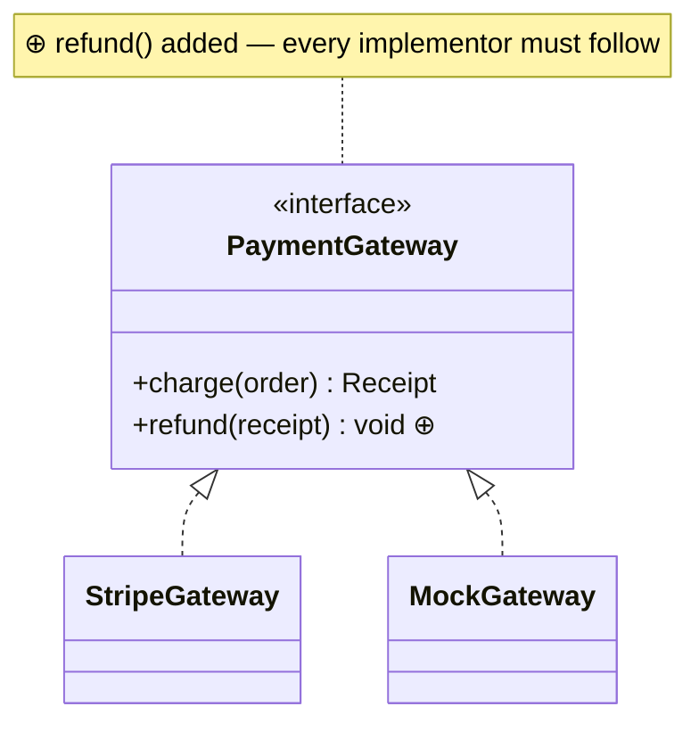

# ER and class examples — data shape and type contracts

Format reference, not a template. Both types answer "what shape does the data
have?" — `erDiagram` for schema/migrations, `classDiagram` for contracts
between types. Styling hooks are limited in both, so ⊕/⊖ markers in labels
carry the diff.

## ER — schema / migration ("how do the entities relate now?")

Anchor in prose: "matches migration `db/migrations/0042_add_refunds.sql`".

## Class — contract between types ("what is the contract now?")

The note names the ripple: a widened interface is a contract change for every
implementor — that is what the reviewer must verify, and the reading order
should point at each implementation file.
