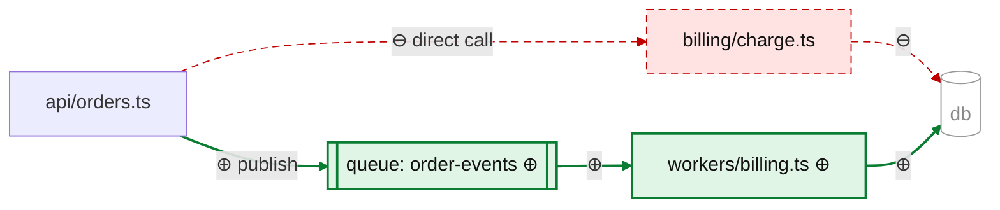
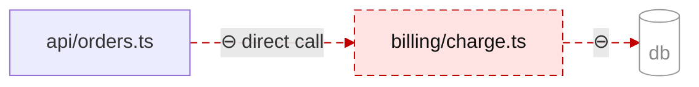
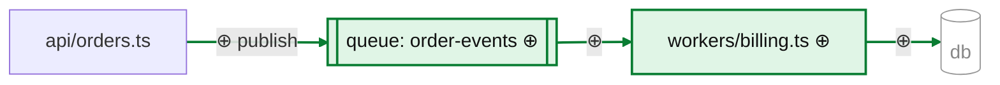

# Flowchart examples — painted delta and painted before/after pair

Format reference, not a template. Skip flowcharts entirely for 1–2 file
groups.

## Painted delta (the default): union of before and after, diff in the styling

One diagram answering "who depends on whom, and what changed in that graph?"
— added solid/thick with ⊕, removed dashed with ⊖, modified in default
styling (undimmed, unmarked — here `api/orders.ts`, whose calls changed),
untouched context dimmed. Every added/removed edge is painted *and* marked,
never just colored.

Edge accounting: `A→B` and `B→C` exist only before the change → removed;
`A→Q`, `Q→W`, `W→C` exist only after → added. A removed node's edges go with
it — do not leave them painted as context.

## Painted before/after pair: only when the topology change IS the story

Two diagrams, same orientation. The anchors are the nodes present on both
sides with the same name and position: `api/orders.ts` (modified — default
styling) and `db` (untouched — dimmed). The "before" paints what leaves; the
"after" paints what arrives. Never ship an unpainted pair.

**Before — what leaves (⊖):**

**After — what arrives (⊕):**

Notes carried by these examples: nodes named by real paths (symbol + path for
sub-file pieces, e.g. `charge() · billing/charge.ts`); modified nodes take
the default styling — dimming marks the untouched, ⊕/⊖ mark the exceptional;
`linkStyle` indices match the edge order in the code — paint edges last;
color never the only signal (dash/weight + ⊕/⊖ ride along).
