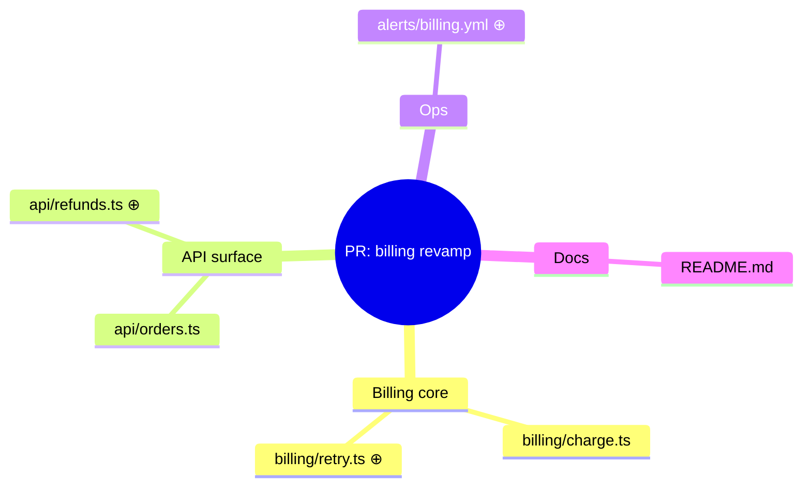
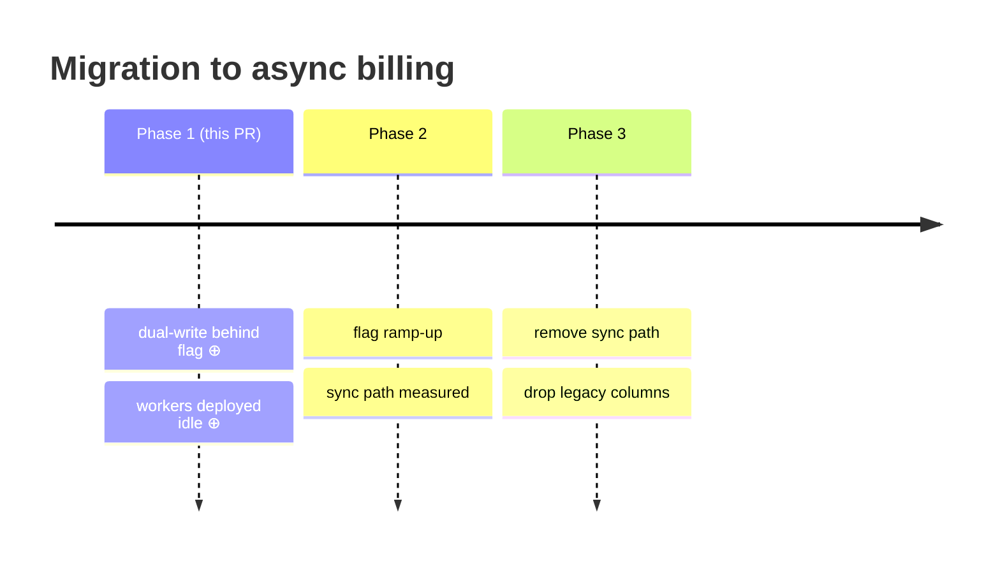

# Mindmap and timeline examples — breadth and phases

Format reference, not a template. Rare types; comprehension outranks PR-page
rendering, so use them when they fit — but only if the user says they will
paste the tour into GitHub, offer a `flowchart`/list fallback (these two
render less reliably there). No styling hooks: ⊕ markers carry the diff.

## Mindmap — broad diff touching loosely related areas ("what does this touch?")

`Legend: ⊕ = file added by this PR · unmarked = existing file the PR modifies`

The second entry is the one that earns the line: without it the unmarked
leaves read as untouched neighbors drawn for context, which is what they mean
in every flowchart of this tour and not what they mean here.

Use it as the opening overview of a sprawling PR, before per-group tours —
it answers breadth, not connection; pair it with a flowchart per group when
connections matter.

## Timeline — phased work ("what happens in which phase?")

`Legend: ⊕ = shipped by this PR · phases without ⊕ = planned, not in this diff`

Mark which phase this PR is — the reviewer's question is usually "how much of
the plan am I approving right now?"
