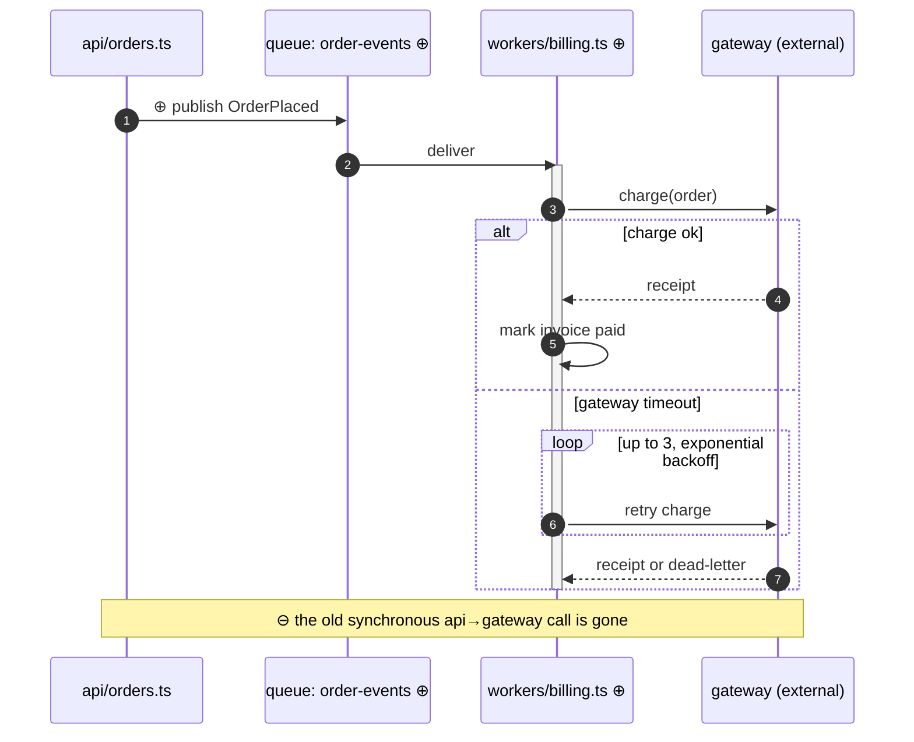

# Sequence example — imperative procedure / runtime interaction

Format reference, not a template. Requires 2+ participants exchanging
messages — a single-actor linear procedure reads better as the numbered list
it already is.

Participants cannot take `classDef` styling, so the diff markers ride in the
display names and message labels: ⊕ new, ⊖ removed. `alt`/`opt` carry the
branches, `loop` the retries, `par` the parallelism that dense prose hides.

One-line title above the diagram in the real tour: "In what order does a
placed order get charged now?" — the question this type answers.
