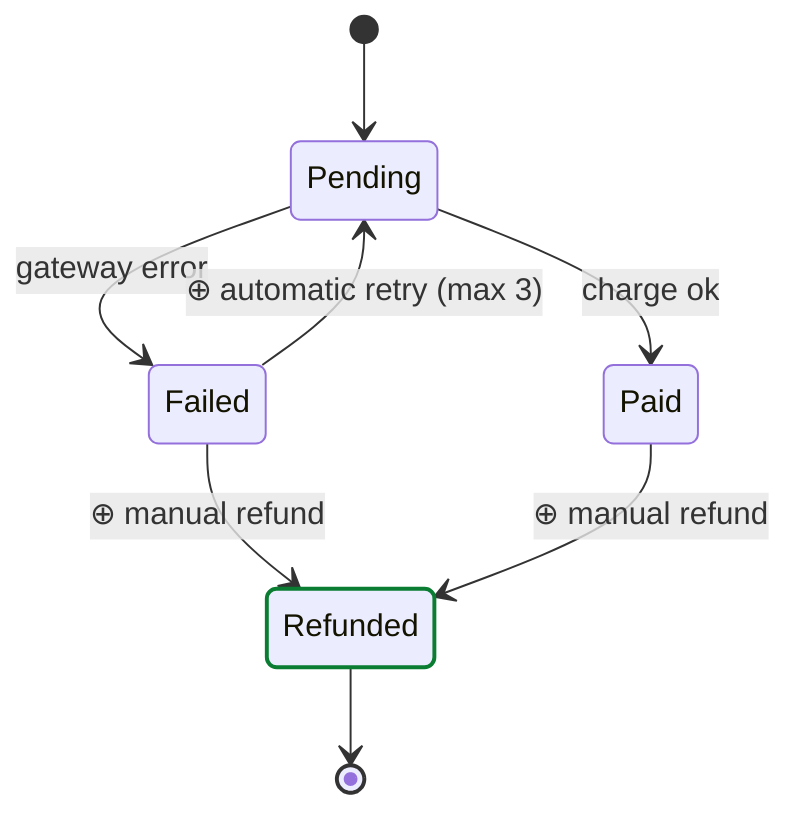

# State example — lifecycle hiding in scattered conditionals

Format reference, not a template. This is the most underrated type in review:
a state machine implemented as scattered `if`s across the diff is exactly
where a reviewer gets lost. Draw the machine the code implies, and paint the
transitions the diff adds or removes.

- New states take `classDef added`; new/removed transitions are marked ⊕/⊖ in
  the transition label (edges cannot be classDef-styled here).
- Anchor the machine to code in the surrounding prose: "implemented across
  `billing/charge.ts:77` and `billing/refund.ts:31`" — not inside the
  diagram.
- Title with the question: "What states can an invoice be in now, and what
  triggers each transition?"
